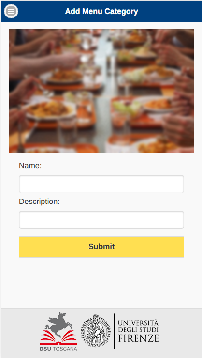
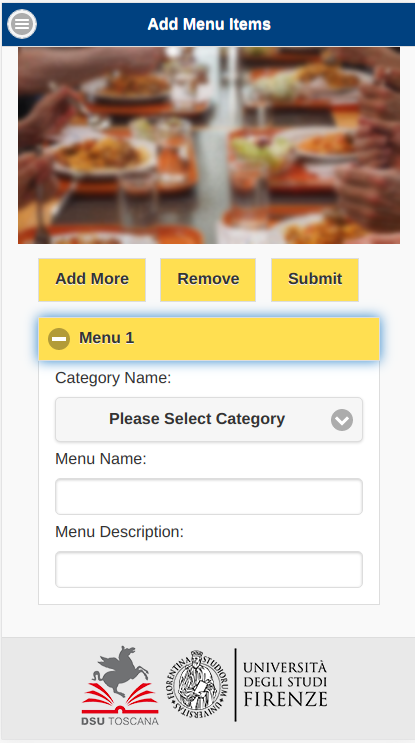
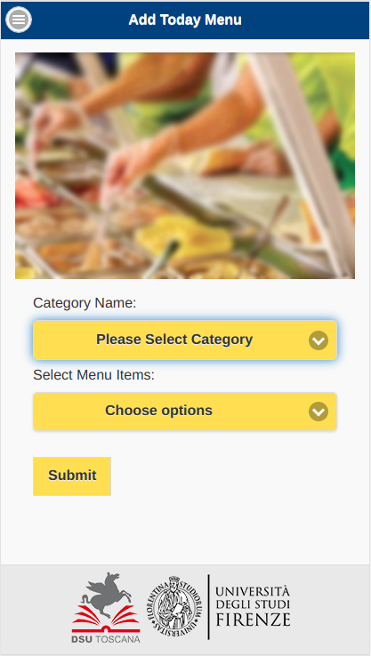
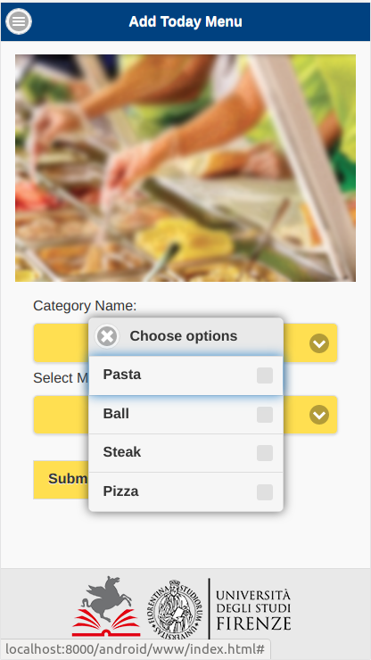
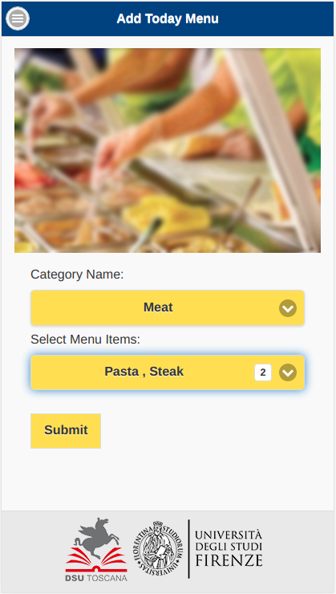
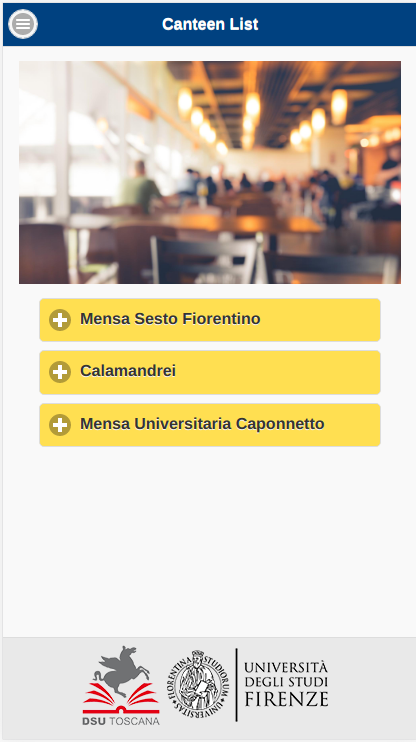
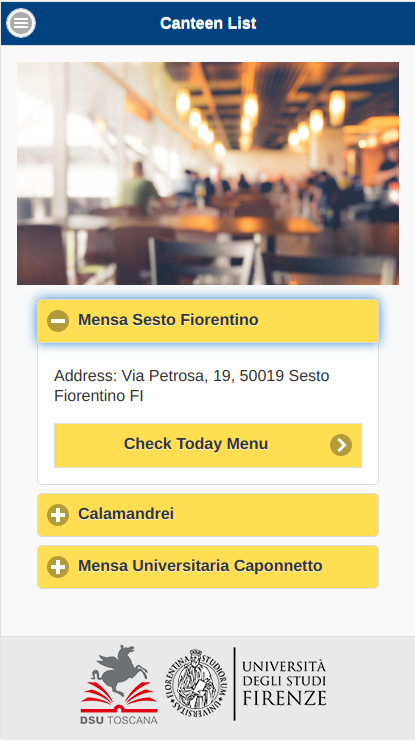

# unifi-canteen-mobile-app
<h2>Overview</h2>
<ul>
  <li>Academic Year: 2019-2021</li>
  <li>Project Title: UNIFI Mensa App</li>
  <li>Students: Shahnawaz Khan</li>
  <li>CFUs: 6</li>
</ul>
<h2>Mobile application development using Cordova</h2>

For creating my mobile application, Cordova framework was used. Cordova is an open-source mobile development framework which allows using standard web technologies like CSS3, JavaScript and HTML5 for developing cross-platform applications. Main purpose of using this framework was to extend an application across more than one platform, without having to re-implement it with each platform’s language and tool set. 
My mobile application is based on two types of users:

<ul>
  <li>Administrative users.</li> 
  <li>Students of Unifi.</li>
</ul>

  
   
  
  
   
  
  

